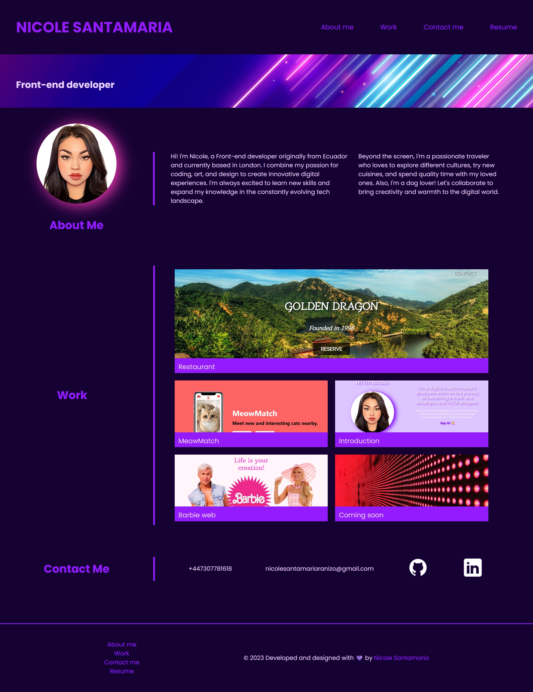

# NicoleSanG-portfolio

This project serves as my portfolio, designed to showcase the programming and design skills I've acquired through my previous studies and during the Bootcamp.

## Usage

- This image displays the portfolio's desktop view. To navigate to specific sections (About Me, Work, Contact), click on the respective options in the navigation bar located at the top right corner. 
- Additionally, you can access my resume in PDF format by clicking on "Resume." 
- The menu at the bottom left corner on the footer, provides the same functionality.
- Click on any part of each image in the Work section to open the deployed project in a new window.
- For a closer look at my GitHub and LinkedIn profiles, click on the corresponding logos in the Contact Me section.

## Credits

Hero image courtesy of https://www.freepik.com/
GitHub and LinkedIn icons: https://icons8.com/icons

I've implemented code to open deployed projects in a new window when users click on the portfolio work section. This was suggested by tutor Phillip Loyd during a tutoring session.
Code snippet in HTML:
onclick="window.open('/path')

## License
MIT License

Copyright (c) [2023] [Karen Nicole Santamaria Granizo]

Permission is hereby granted, free of charge, to any person obtaining a copy
of this software and associated documentation files (the "Software"), to deal
in the Software without restriction, including without limitation the rights
to use, copy, modify, merge, publish, distribute, sublicense, and/or sell
copies of the Software, and to permit persons to whom the Software is
furnished to do so, subject to the following conditions:

The above copyright notice and this permission notice shall be included in all
copies or substantial portions of the Software.

THE SOFTWARE IS PROVIDED "AS IS", WITHOUT WARRANTY OF ANY KIND, EXPRESS OR
IMPLIED, INCLUDING BUT NOT LIMITED TO THE WARRANTIES OF MERCHANTABILITY,
FITNESS FOR A PARTICULAR PURPOSE AND NONINFRINGEMENT. IN NO EVENT SHALL THE
AUTHORS OR COPYRIGHT HOLDERS BE LIABLE FOR ANY CLAIM, DAMAGES OR OTHER
LIABILITY, WHETHER IN AN ACTION OF CONTRACT, TORT OR OTHERWISE, ARISING FROM,
OUT OF OR IN CONNECTION WITH THE SOFTWARE OR THE USE OR OTHER DEALINGS IN THE
SOFTWARE.

## Badges

